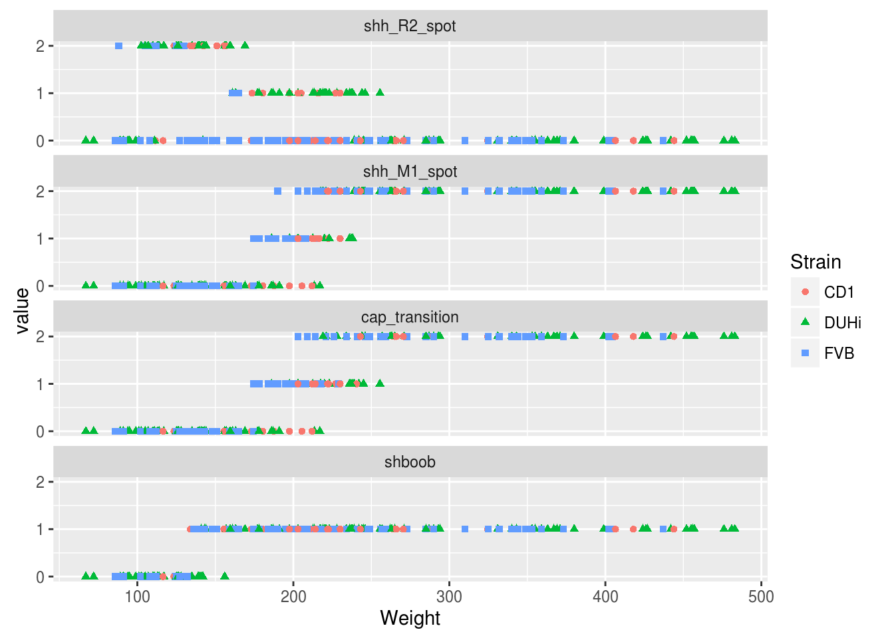

#Import


#Logistic regression

```
## 
## Call:
## glm(formula = shh_R2_spot ~ Weight + Strain, family = "binomial", 
##     data = subsmxstg)
## 
## Deviance Residuals: 
##     Min       1Q   Median       3Q      Max  
## -2.2347  -0.5869  -0.3057   0.7018   1.9191  
## 
## Coefficients:
##              Estimate Std. Error z value Pr(>|z|)    
## (Intercept)  3.415079   0.644062   5.302 1.14e-07 ***
## Weight      -0.014987   0.002778  -5.396 6.83e-08 ***
## StrainFVB   -2.611178   0.453435  -5.759 8.48e-09 ***
## ---
## Signif. codes:  0 '***' 0.001 '**' 0.01 '*' 0.05 '.' 0.1 ' ' 1
## 
## (Dispersion parameter for binomial family taken to be 1)
## 
##     Null deviance: 234.79  on 181  degrees of freedom
## Residual deviance: 156.32  on 179  degrees of freedom
## AIC: 162.32
## 
## Number of Fisher Scoring iterations: 5
```

```
## 
## Call:
## glm(formula = shh_M1_spot ~ Weight + Strain, family = "binomial", 
##     data = subsmxstg)
## 
## Deviance Residuals: 
##      Min        1Q    Median        3Q       Max  
## -2.32795  -0.00976   0.00000   0.01524   2.10276  
## 
## Coefficients:
##              Estimate Std. Error z value Pr(>|z|)    
## (Intercept) -30.50770    7.71361  -3.955 7.65e-05 ***
## Weight        0.15276    0.03807   4.013 5.99e-05 ***
## StrainFVB     3.69192    1.40794   2.622  0.00874 ** 
## ---
## Signif. codes:  0 '***' 0.001 '**' 0.01 '*' 0.05 '.' 0.1 ' ' 1
## 
## (Dispersion parameter for binomial family taken to be 1)
## 
##     Null deviance: 247.981  on 181  degrees of freedom
## Residual deviance:  27.895  on 179  degrees of freedom
## AIC: 33.895
## 
## Number of Fisher Scoring iterations: 10
```

```
## 
## Call:
## glm(formula = cap_transition ~ Weight + Strain, family = "binomial", 
##     data = subsmxstg)
## 
## Deviance Residuals: 
##      Min        1Q    Median        3Q       Max  
## -2.32795  -0.00976   0.00000   0.01524   2.10276  
## 
## Coefficients:
##              Estimate Std. Error z value Pr(>|z|)    
## (Intercept) -30.50770    7.71361  -3.955 7.65e-05 ***
## Weight        0.15276    0.03807   4.013 5.99e-05 ***
## StrainFVB     3.69192    1.40794   2.622  0.00874 ** 
## ---
## Signif. codes:  0 '***' 0.001 '**' 0.01 '*' 0.05 '.' 0.1 ' ' 1
## 
## (Dispersion parameter for binomial family taken to be 1)
## 
##     Null deviance: 247.981  on 181  degrees of freedom
## Residual deviance:  27.895  on 179  degrees of freedom
## AIC: 33.895
## 
## Number of Fisher Scoring iterations: 10
```

```
## 
## Call:
## glm(formula = shboob ~ Weight + Strain, family = "binomial", 
##     data = subsmxstg)
## 
## Deviance Residuals: 
##      Min        1Q    Median        3Q       Max  
## -2.60759  -0.00002   0.00000   0.00008   1.58098  
## 
## Coefficients:
##             Estimate Std. Error z value Pr(>|z|)   
## (Intercept) -41.1241    14.9883  -2.744  0.00607 **
## Weight        0.2852     0.1053   2.709  0.00675 **
## StrainFVB     2.7805     1.4312   1.943  0.05204 . 
## ---
## Signif. codes:  0 '***' 0.001 '**' 0.01 '*' 0.05 '.' 0.1 ' ' 1
## 
## (Dispersion parameter for binomial family taken to be 1)
## 
##     Null deviance: 205.781  on 181  degrees of freedom
## Residual deviance:  22.367  on 179  degrees of freedom
## AIC: 28.367
## 
## Number of Fisher Scoring iterations: 12
```

#Graphing

#Each character in its own plot


```
## svg 
##   3
```

```
## png 
##   2
```

```
## pdf 
##   3
```

```
## png 
##   2
```

```
## png 
##   3
```

```
## png 
##   2
```

no cd1
